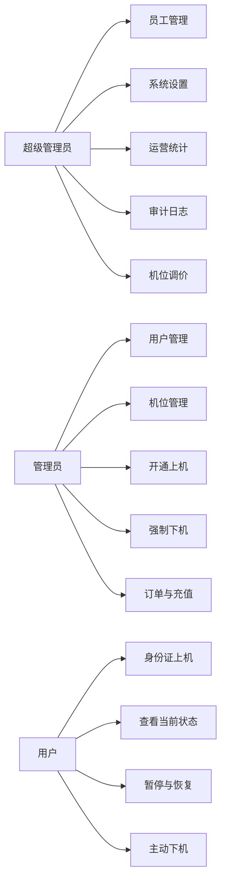
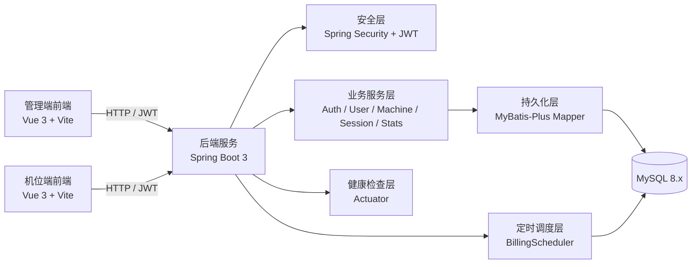
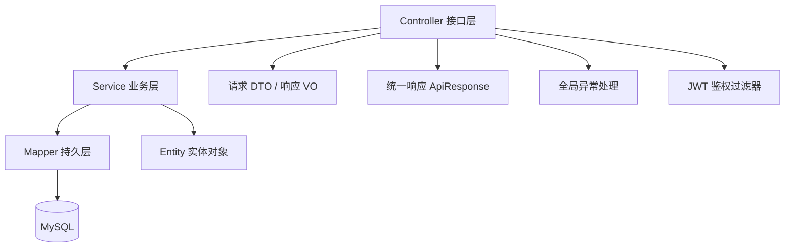
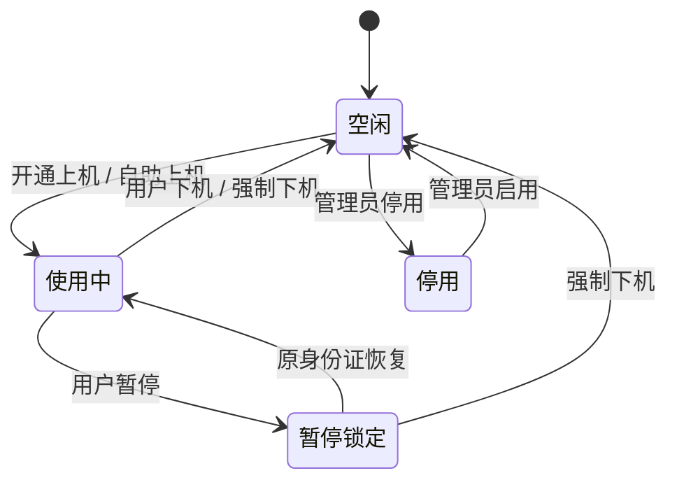
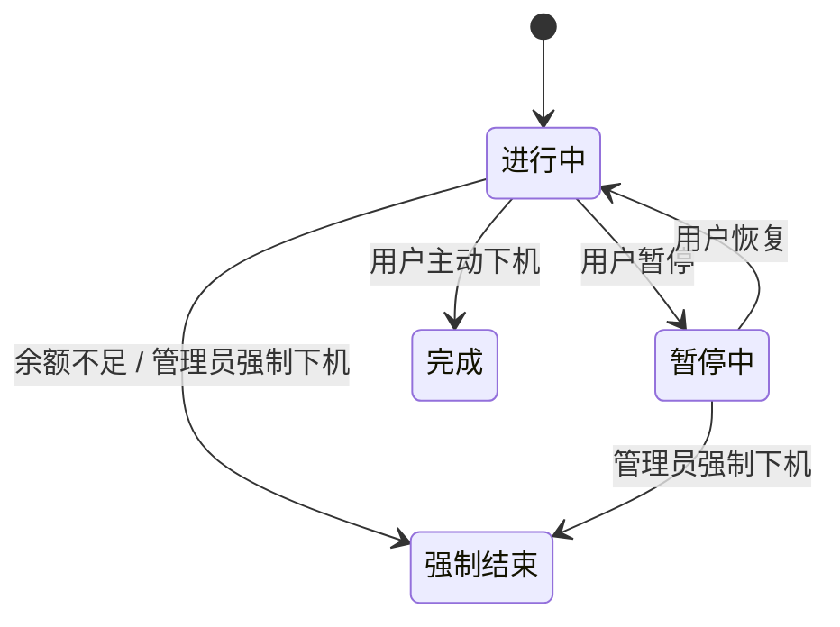
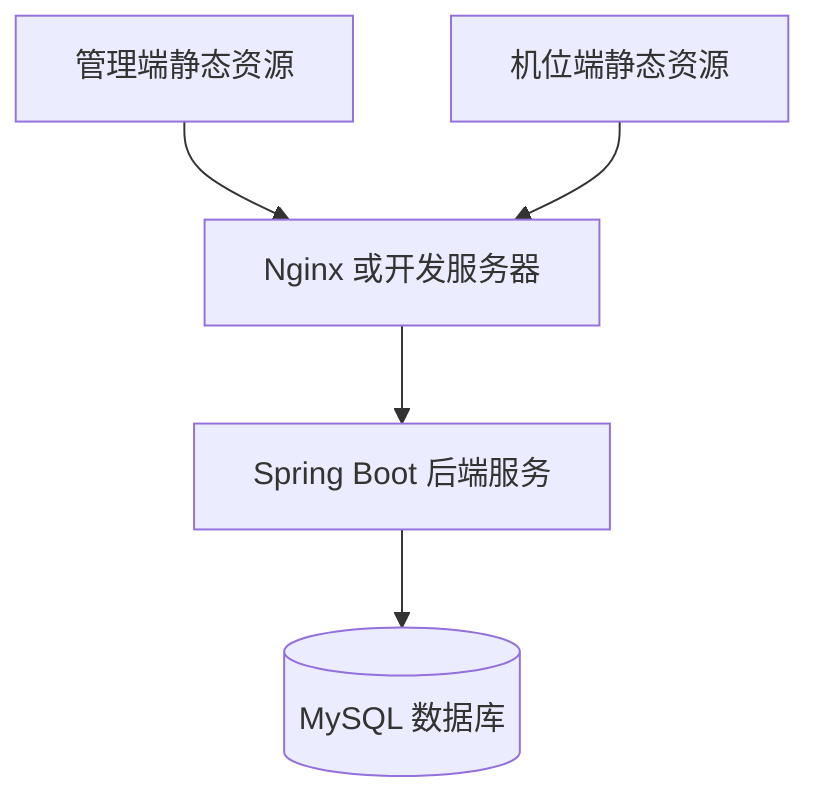
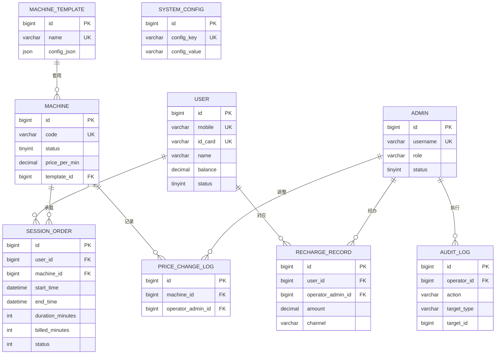
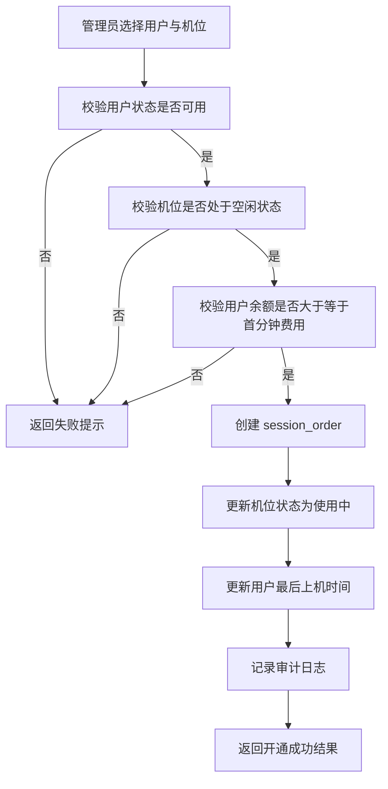
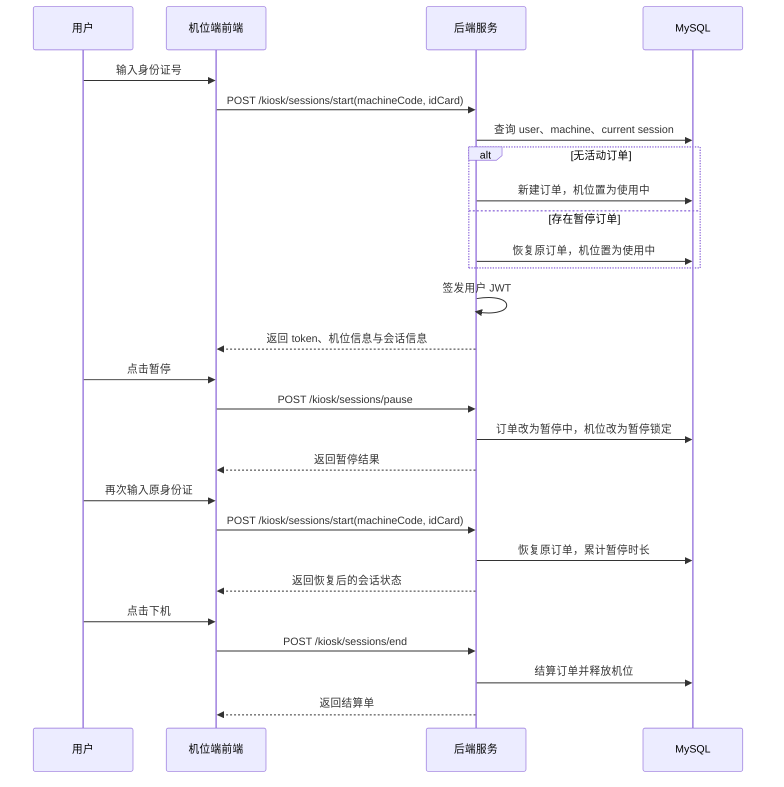
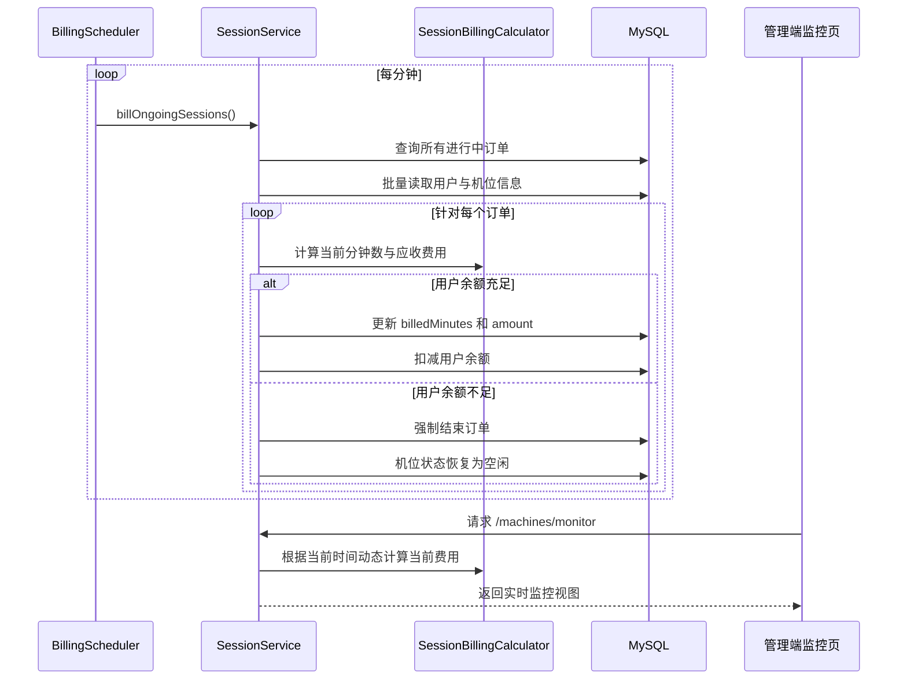

# 网咖管理系统设计与实现说明

## 第1章 绪论

### 1.1 课题背景

随着信息化技术在服务行业中的广泛应用，网咖、电竞馆等线下娱乐场所的经营模式也在逐步从人工管理向数字化管理转变。传统网咖管理通常依赖人工登记、纸质记录或者简单电子表格来维护用户信息、机位状态、充值记录和上机时长。这种方式虽然在业务量较小的情况下尚可维持，但随着门店规模扩大和用户数量增长，会迅速暴露出效率低、易出错、难追溯和缺少数据支撑等问题。

在传统管理模式下，管理员往往需要人工完成以下工作：

- 记录用户身份信息和联系方式；
- 人工判断机位是否可用；
- 为用户分配机位并记录开始时间；
- 根据经验或人工计算用户应支付的上机金额；
- 在用户充值、冻结、解冻和强制下机时进行手工登记；
- 对日常运营情况进行粗粒度统计。

这种操作模式存在明显缺陷：

- 管理流程依赖人工记忆，容易导致漏记、错记；
- 机位状态更新不及时，管理员难以实时掌握门店运营状态；
- 用户余额、充值记录和上机订单分散，缺乏统一管理；
- 对关键操作没有审计留痕，事后难以追责；
- 缺少基础运营统计，不利于经营分析与决策。

因此，设计并实现一个面向单门店场景的网咖管理系统，既具有现实应用价值，也具有较好的系统分析与软件设计研究意义。

### 1.2 课题研究目的与意义

本课题的研究目的，是构建一套覆盖网咖日常核心业务场景的管理系统，通过信息化手段提高运营效率、降低人工成本，并形成相对完整的系统分析、架构设计与工程实现方案。

该系统的建设意义主要体现在以下几个方面：

#### 1.2.1 管理效率提升

通过统一的后台管理平台，将员工管理、用户管理、机位管理、上机管理、充值管理和统计分析整合到同一系统中，降低业务切换成本，提高操作效率。

#### 1.2.2 计费过程规范化

通过分钟级自动计费和余额控制机制，减少人工结算误差，使订单金额计算更加准确和一致。

#### 1.2.3 运营过程可视化

通过机位监控、当前订单状态和运营统计模块，让管理者能够实时掌握机位使用情况、用户消费情况和整体经营表现。

#### 1.2.4 系统设计研究价值

本课题在有限范围内综合运用了需求分析、权限控制、状态机建模、数据库设计、接口设计、定时任务、日志审计和前后端分离架构等软件工程技术，具备较强的课程设计和毕业设计示范意义。

### 1.3 课题研究内容

本系统围绕网咖日常运营流程展开设计与实现，研究内容主要包括以下几个方面：

1. 对网咖经营场景进行需求分析，明确角色划分、业务流程和功能边界。
2. 设计系统总体架构，包括前后端分离架构、权限模型、模块边界和部署方式。
3. 设计数据库表结构，完成用户、员工、机位、订单、充值、配置和审计等核心数据模型设计。
4. 设计并实现后台管理端的员工管理、用户管理、机位管理、订单与充值、运营统计、系统设置和审计日志等功能。
5. 设计并实现机位端自助上机流程，包括身份证登录、暂停、恢复、下机与结算能力。
6. 建立分钟级计费机制和实时监控机制，形成完整的业务闭环。

### 1.4 系统建设目标

结合课题定位，系统建设目标可以归纳为以下几点：

- 面向单网咖场景，构建一套可运行、可展示、可维护的管理系统；
- 为超级管理员、管理员和用户提供差异化功能能力；
- 支持机位端自助上机，降低人工参与程度；
- 实现基于余额的分钟级自动计费；
- 支持关键操作审计和基础运营统计；
- 采用清晰的分层设计，为后续扩展预留空间。

### 1.5 本文档结构

本文档按照毕业设计正文的常见写法组织，共分为六章：

- 第1章：绪论，介绍课题背景、研究目的与研究内容；
- 第2章：需求分析，说明系统建设需求、角色需求、功能需求和非功能需求；
- 第3章：系统总体设计，说明架构、技术选型、模块划分和权限模型；
- 第4章：系统详细设计，重点介绍数据库设计、功能设计和关键业务流程；
- 第5章：系统实现，说明系统关键模块的实现方式和技术落地；
- 第6章：总结与展望，对系统进行总结并提出后续优化方向。

## 第2章 需求分析

### 2.1 业务场景分析

本系统面向单门店网咖运营场景，其核心参与者包括超级管理员、普通管理员和上机用户。系统需要覆盖从用户建档、余额充值、机位分配、开始上机、自动计费、暂停恢复、订单结算到运营统计的完整业务链路。

从实际运营角度看，网咖的典型业务流程包括：

1. 管理员维护员工账号与权限；
2. 管理员建立用户档案，并根据需要为用户充值；
3. 管理员维护机位信息、机位状态和机位模板；
4. 用户通过管理员分配或机位端自助方式开始上机；
5. 系统按分钟计费，并在余额不足时自动处理；
6. 用户主动下机或管理员强制下机，形成最终订单；
7. 管理员查看充值流水、订单数据和统计分析结果；
8. 超级管理员维护系统参数并查看审计日志。

### 2.2 传统管理方式的痛点分析

通过对网咖业务流程的抽象，可以识别出现有管理方式的主要问题：

#### 2.2.1 人工登记效率低

传统方式下，用户信息和充值信息常常由人工录入并分散记录，导致查询困难、重复劳动较多，且在高峰时段容易出现遗漏。

#### 2.2.2 机位状态不透明

当多个管理员轮班工作时，如果缺少统一系统，机位的空闲、使用、停用和暂停状态难以及时同步，影响资源利用率。

#### 2.2.3 计费过程缺少统一规则

人工按时间估算费用容易产生误差，也难以支撑余额不足自动下机、低余额提醒等细粒度业务需求。

#### 2.2.4 缺少运营数据沉淀

没有统一系统时，很难快速统计某时间段的充值流水、上机收入、活跃用户数和机位使用率，导致经营决策缺乏数据支持。

#### 2.2.5 缺少关键操作留痕

如果没有审计机制，在发生误操作、越权操作或金额争议时，很难定位操作人和操作时间。

### 2.3 可行性分析

#### 2.3.1 技术可行性

本系统采用 Spring Boot、Spring Security、MyBatis-Plus、MySQL、Vue 3 和 Vite 等成熟技术，相关生态稳定、资料丰富、上手成本低。系统采用单体架构即可满足当前单门店场景，对硬件资源要求不高，因此在技术上具有较高可行性。

#### 2.3.2 经济可行性

本系统主要依赖开源技术栈，无需购买昂贵商业中间件。对于毕业设计或小型门店 Demo 场景，只需要常规开发设备和一套 MySQL 数据库即可完成部署，因此具备较高经济可行性。

#### 2.3.3 操作可行性

管理端界面以列表、表单和统计面板为主，操作逻辑直观；机位端采用“预绑定机位编号 + 用户输入身份证号”的交互方式，用户学习成本低。因此在操作层面具有较好可行性。

### 2.4 角色需求分析

系统中的角色分为超级管理员、管理员和用户三类，不同角色的需求存在明显差异。

#### 2.4.1 超级管理员需求

超级管理员是系统的最高权限角色，主要需求包括：

- 登录后台查看整体运营数据；
- 管理管理员账号与角色；
- 维护系统基础参数；
- 调整机位价格；
- 查看关键操作审计日志；
- 查看运营统计结果；
- 管理机位模板和系统级配置。

#### 2.4.2 管理员需求

管理员面向日常运营工作，主要需求包括：

- 查询和维护用户档案；
- 冻结、解冻用户；
- 为用户执行线下充值；
- 管理机位状态和机位信息；
- 为用户开通上机；
- 强制结束订单；
- 查询订单和充值流水；
- 查看实时机位与订单监控数据。

#### 2.4.3 用户需求

用户在本系统中的行为主要发生在机位端，主要需求包括：

- 在已绑定机位编号的机位端输入身份证进行上机；
- 查看当前机位、单价、时长、费用和剩余余额；
- 在离开机位时进行暂停；
- 返回后再次输入身份证恢复上机；
- 主动下机并查看结算结果。

### 2.5 功能需求分析

结合页面原型、业务流程和当前实现，系统功能需求可划分为以下模块。

#### 2.5.1 认证模块

认证模块需要支持：

- 管理员账号密码登录；
- 管理员退出登录；
- 机位端用户身份证登录；
- 基于 JWT 的身份标识与角色识别。

#### 2.5.2 员工管理模块

员工管理模块主要用于后台员工账号维护，功能需求包括：

- 获取角色选项；
- 查询员工列表；
- 新增员工；
- 编辑员工；
- 启用与禁用员工；
- 重置密码；
- 删除员工；
- 保证系统至少保留一个启用中的超级管理员。

#### 2.5.3 用户管理模块

用户管理模块面向网咖客户档案维护，功能需求包括：

- 新增用户档案；
- 编辑用户资料；
- 查询用户详情；
- 冻结和解冻用户；
- 查询用户充值记录；
- 查询用户上机记录；
- 为用户充值并更新余额。

#### 2.5.4 机位管理模块

机位管理模块用于维护门店机位资源，功能需求包括：

- 维护机位编号、单价和配置信息；
- 支持新增、编辑、启用和停用机位；
- 支持单机位调价；
- 支持基于模板批量创建机位；
- 查询机位监控列表并展示当前用户、当前费用和当前时长。

#### 2.5.5 上机管理模块

上机管理模块是系统核心模块之一，功能需求包括：

- 管理员后台开通上机；
- 查询当前活跃订单；
- 查询历史订单；
- 管理员强制下机；
- 支持进行中和暂停中的订单统一管理。

#### 2.5.6 订单与充值模块

订单与充值模块承担财务相关的基础查询和录入需求，功能包括：

- 查询已完成和强制结束订单；
- 查询线下充值流水；
- 获取充值渠道选项；
- 执行线下充值操作。

#### 2.5.7 运营统计模块

运营统计模块用于展示系统的运营情况，功能需求包括：

- 展示总流水、上机收入、总上机时长、活跃用户和 ARPU；
- 展示按日或按月的趋势数据；
- 展示机位使用率排行；
- 展示机位收入 TOP；
- 展示长时间闲置机位；
- 展示用户消费 TOP；
- 展示低余额用户；
- 提供综合榜单接口供前端直接渲染。

#### 2.5.8 系统设置模块

系统设置模块用于维护全局参数，功能需求包括：

- 获取默认单价；
- 获取低余额提醒阈值；
- 修改基础参数；
- 维护常用机位模板。

#### 2.5.9 审计日志模块

审计日志模块用于对系统关键操作进行留痕，功能需求包括：

- 查询审计日志；
- 按操作人、操作类型、时间范围进行筛选；
- 获取审计类型选项；
- 自动记录关键操作的前后变化数据。

#### 2.5.10 机位端客户端模块

机位端模块面向用户自助上机场景，功能需求包括：

- 获取机位概览；
- 开始上机；
- 查询当前会话状态；
- 暂停会话；
- 恢复会话；
- 获取下机预结算；
- 用户主动下机；
- 获取最近一次已结束结算单。

### 2.6 非功能需求分析

#### 2.6.1 安全性需求

系统需要具备基础安全控制能力，包括：

- 管理端接口必须经过身份认证；
- 不同角色访问不同资源；
- 敏感身份信息在前端展示时进行脱敏；
- 关键操作需要具备审计留痕；
- 登录令牌需要具备失效时间。

#### 2.6.2 可用性需求

系统需要在日常网咖运营中保持较好的可用性：

- 操作流程尽量简洁，减少人工步骤；
- 核心业务失败时提供明确错误提示；
- 机位端支持快速登录和快速恢复；
- 后台监控信息应尽可能实时更新。

#### 2.6.3 可维护性需求

为了支撑后续迭代，系统需要具备较好的可维护性：

- 后端采用清晰的分层设计；
- 数据对象与接口对象分离；
- 统一响应结构和统一异常处理；
- 功能模块边界清晰，便于扩展。

#### 2.6.4 性能需求

虽然本系统面向单门店 Demo 场景，但仍需考虑基础性能问题：

- 查询条件应尽量命中索引；
- 统计接口应限制时间范围；
- 实时监控数据应避免复杂联表和大范围全表扫描；
- 计费逻辑应可稳定按分钟执行。

### 2.7 系统用例分析

为了进一步明确角色与功能之间的对应关系，可以将系统主要用例抽象如下。



该用例分析说明了系统设计中的权限边界：  
超级管理员偏向系统级管理，管理员偏向门店运营，用户仅与机位端交互。

## 第3章 系统总体设计

### 3.1 设计目标与设计原则

为了使系统既能满足当前需求，又具备合理的扩展空间，在总体设计阶段遵循以下原则：

#### 3.1.1 面向业务闭环设计

系统不追求过度复杂的大而全能力，而是围绕“用户、机位、订单、充值、统计”五条主线构建完整业务闭环。

#### 3.1.2 前后端分离设计

管理端和机位端分别作为独立前端项目，通过 REST API 调用后端服务，便于界面独立演进和并行开发。

#### 3.1.3 状态驱动设计

机位状态和订单状态是系统关键控制点，因此系统在设计中采用显式状态枚举，确保业务规则可表达、可判断、可追踪。

#### 3.1.4 索引友好设计

考虑到运营列表和统计查询在系统中占比较高，系统在建模时优先围绕核心筛选条件建立索引，以减少查询风险。

#### 3.1.5 审计优先设计

涉及金额、状态和配置变更的关键动作，均纳入审计范围，以提高系统可信度与问题追踪能力。

### 3.2 系统总体架构设计

系统采用典型的前后端分离架构，整体由管理端、机位端、后端服务和 MySQL 数据库组成。



如图所示，系统的核心处理逻辑全部集中在后端服务中。前端主要承担展示和交互职责，后端则负责鉴权、业务规则、数据持久化、自动计费与统计聚合。

### 3.3 技术架构与选型说明

#### 3.3.1 前端技术选型

管理端和机位端都采用 Vue 3 + TypeScript + Vue Router + Vite。  
选择该组合的原因如下：

- Vue 3 适合快速构建后台管理界面和轻交互页面；
- TypeScript 提升代码可读性和维护性；
- Vue Router 能够支持后台菜单与机位端路由切换；
- Vite 启动速度快，适合前端项目开发。

#### 3.3.2 后端技术选型

后端采用 Spring Boot 3.2.2 作为核心框架，并结合以下组件：

- Spring Security：实现身份认证和接口鉴权；
- JWT：实现无状态令牌认证；
- MyBatis-Plus：简化数据访问层开发；
- Spring Validation：实现请求参数校验；
- Spring Actuator：提供基础健康检查；
- Spring Scheduling：实现定时计费任务。

#### 3.3.3 数据库技术选型

数据库采用 MySQL 8.x，原因如下：

- 支持常见事务、索引和 JSON 字段；
- 与 Spring Boot 生态配合成熟；
- 适合单体项目和课程设计场景部署；
- 运维和导出恢复成本低。

### 3.4 系统逻辑分层设计

为了保证业务边界清晰、职责明确，后端采用 Controller、Service、Mapper、Entity、DTO/VO 的分层方式。



各层职责如下：

- Controller：负责接收请求、参数映射和响应封装；
- Service：负责业务规则校验、事务控制和多对象协同；
- Mapper：负责数据库 CRUD 和条件查询；
- Entity：映射表结构；
- DTO/VO：承担数据输入输出职责；
- Common/Config：提供统一响应、异常处理、安全配置和横切功能。

### 3.5 模块划分设计

根据业务职责，系统划分为以下模块：

| 模块 | 职责说明 | 主要接口 |
| --- | --- | --- |
| 认证模块 | 管理员登录、机位端用户登录、令牌签发 | `/auth/**`、`/kiosk/sessions/start` |
| 员工管理模块 | 员工账号、角色和状态管理 | `/admins/**` |
| 用户管理模块 | 用户档案、状态、余额和历史记录管理 | `/users/**` |
| 机位管理模块 | 机位、模板、价格和监控管理 | `/machines/**`、`/machine-templates/**` |
| 上机管理模块 | 开通上机、强制下机、当前订单和历史订单管理 | `/sessions/**` |
| 订单与充值模块 | 已结束订单、线下充值流水和充值执行 | `/session-orders`、`/recharges/**` |
| 运营统计模块 | 总览、趋势、排行和低余额统计 | `/stats/**` |
| 系统设置模块 | 基础配置与模板维护 | `/system/**` |
| 审计日志模块 | 关键操作留痕和检索 | `/audit/**` |
| 机位端模块 | 自助上机、暂停、恢复、下机和状态查询 | `/kiosk/**` |

### 3.6 权限模型设计

系统采用基于角色的访问控制模型，不同角色对不同资源具有不同访问能力。

| 功能域 | SUPER_ADMIN | ADMIN | USER |
| --- | --- | --- | --- |
| 管理员登录/登出 | 支持 | 支持 | 不适用 |
| 员工管理 | 支持 | 不支持 | 不支持 |
| 用户管理 | 支持 | 支持 | 不支持 |
| 机位管理 | 支持 | 支持 | 不支持 |
| 机位调价 | 支持 | 不支持 | 不支持 |
| 上机管理 | 支持 | 支持 | 不支持 |
| 订单与充值 | 支持 | 支持 | 不支持 |
| 运营统计 | 支持 | 不支持 | 不支持 |
| 系统设置 | 支持 | 不支持 | 不支持 |
| 审计日志 | 支持 | 不支持 | 不支持 |
| 机位端当前状态/暂停/下机 | 不支持 | 不支持 | 支持 |

权限控制由 `SecurityConfig` 统一配置，典型策略包括：

- `/admins/**` 仅超级管理员可访问；
- `/users/**`、`/machines/**`、`/recharges/**` 等由管理员和超级管理员共享；
- `/stats/**`、`/audit/**`、`/system/**` 仅超级管理员可访问；
- `/kiosk/machines/*/overview` 和 `/kiosk/sessions/start` 对外开放；
- 机位端其它接口需要 `USER` 角色令牌。

### 3.7 状态模型设计

#### 3.7.1 机位状态设计

机位状态定义如下：

| 状态值 | 状态名称 | 说明 |
| --- | --- | --- |
| 0 | 空闲 | 机位可被分配或自助上机 |
| 1 | 使用中 | 当前存在活跃会话 |
| 2 | 停用 | 机位暂不可用 |
| 3 | 暂停锁定 | 用户暂停后临时锁定，需原身份证恢复 |

机位状态流转图如下：



#### 3.7.2 上机订单状态设计

订单状态定义如下：

| 状态值 | 状态名称 | 说明 |
| --- | --- | --- |
| 0 | 进行中 | 订单正在计费 |
| 1 | 完成 | 用户主动正常下机 |
| 2 | 强制结束 | 管理员强制下机或余额不足自动结束 |
| 3 | 暂停中 | 用户暂停，时长与费用冻结 |

订单状态流转图如下：



### 3.8 部署设计

当前系统定位为单体应用，部署方案相对简单。典型部署结构如下：



在开发环境中，管理端和机位端通常通过各自的 Vite 开发服务器运行，后端独立运行在 `8080` 端口；在实际部署中，可通过 Nginx 统一代理前端资源和后端 API。

## 第4章 系统详细设计

### 4.1 数据库设计

#### 4.1.1 数据库设计思路

数据库设计围绕“用户、管理员、机位、订单、充值、配置、日志”七类核心业务对象展开。  
设计中遵循以下原则：

- 核心对象一表一职责，避免过度混合；
- 金额与状态字段保留足够语义表达能力；
- 关键查询字段建立索引，保证列表与统计性能；
- 日志和变更记录单独建表，增强可追溯性；
- 使用 JSON 字段承载机位配置信息，增强灵活性。

#### 4.1.2 E-R 关系设计

系统核心实体关系如图所示：



从关系图可以看出：

- 一个用户可以对应多条上机订单和多条充值记录；
- 一个机位可以对应多条历史订单和多次调价记录；
- 一个模板可以被多个机位复用；
- 一个管理员可以产生多条充值经办记录、调价记录和审计记录。

#### 4.1.3 主要数据表设计

##### 4.1.3.1 用户表 `user`

用户表用于维护网咖客户档案和账户余额，字段设计如下：

| 字段名 | 类型 | 约束 | 说明 |
| --- | --- | --- | --- |
| id | BIGINT | PK, AUTO_INCREMENT | 用户主键 |
| mobile | VARCHAR(20) | NOT NULL, UNIQUE | 手机号 |
| id_card | VARCHAR(20) | NOT NULL, UNIQUE | 身份证号 |
| name | VARCHAR(50) | NOT NULL | 用户姓名 |
| balance | DECIMAL(10,2) | NOT NULL, DEFAULT 0.00 | 当前余额 |
| status | TINYINT | NOT NULL, DEFAULT 1 | 用户状态，1 可用，0 冻结 |
| register_time | DATETIME | NOT NULL | 注册时间 |
| last_login_time | DATETIME | NULL | 最近登录时间 |
| last_session_time | DATETIME | NULL | 最近上机时间 |
| created_at | DATETIME | NOT NULL | 创建时间 |
| updated_at | DATETIME | NOT NULL | 更新时间 |

设计说明：

- `mobile` 和 `id_card` 采用唯一约束，避免重复建档；
- `balance` 直接承载账户金额，支撑充值与扣费；
- `status` 用于控制是否允许上机；
- `last_session_time` 有助于后续展示最近上机时间和活跃判断。

##### 4.1.3.2 管理员表 `admin`

管理员表用于后台员工账号与角色管理，字段设计如下：

| 字段名 | 类型 | 约束 | 说明 |
| --- | --- | --- | --- |
| id | BIGINT | PK, AUTO_INCREMENT | 管理员主键 |
| username | VARCHAR(50) | NOT NULL, UNIQUE | 登录账号 |
| password | VARCHAR(255) | NOT NULL | 登录密码 |
| name | VARCHAR(50) | NOT NULL | 姓名 |
| role | VARCHAR(20) | NOT NULL | 角色，`SUPER_ADMIN` 或 `ADMIN` |
| status | TINYINT | NOT NULL, DEFAULT 1 | 状态，1 启用，0 禁用 |
| last_login_time | DATETIME | NULL | 最近登录时间 |
| created_at | DATETIME | NOT NULL | 创建时间 |
| updated_at | DATETIME | NOT NULL | 更新时间 |

设计说明：

- `role` 用于控制系统权限边界；
- `status` 用于管理员停用逻辑；
- `last_login_time` 用于后台展示最近登录时间。

##### 4.1.3.3 机位表 `machine`

机位表是机位管理和上机业务的核心基础表，字段设计如下：

| 字段名 | 类型 | 约束 | 说明 |
| --- | --- | --- | --- |
| id | BIGINT | PK, AUTO_INCREMENT | 机位主键 |
| code | VARCHAR(32) | NOT NULL, UNIQUE | 机位编号 |
| status | TINYINT | NOT NULL, DEFAULT 0 | 机位状态 |
| price_per_min | DECIMAL(10,4) | NOT NULL, DEFAULT 0.1000 | 机位单价 |
| config_json | JSON | NOT NULL | 机位配置 JSON |
| template_id | BIGINT | NULL | 引用模板 ID |
| last_maintained_at | DATETIME | NULL | 最近维护时间 |
| created_at | DATETIME | NOT NULL | 创建时间 |
| updated_at | DATETIME | NOT NULL | 更新时间 |

设计说明：

- `code` 是机位业务唯一标识；
- `price_per_min` 支撑机位级定价；
- `config_json` 保存硬件配置，增强灵活性；
- `template_id` 支撑模板化快速建机位能力。

##### 4.1.3.4 机位模板表 `machine_template`

机位模板表用于保存可复用配置，字段设计如下：

| 字段名 | 类型 | 约束 | 说明 |
| --- | --- | --- | --- |
| id | BIGINT | PK, AUTO_INCREMENT | 模板主键 |
| name | VARCHAR(50) | NOT NULL, UNIQUE | 模板名称 |
| config_json | JSON | NOT NULL | 模板配置 |
| created_at | DATETIME | NOT NULL | 创建时间 |
| updated_at | DATETIME | NOT NULL | 更新时间 |

设计说明：

- 模板名称唯一，便于识别；
- 模板配置可直接被机位复制使用；
- 适合常用硬件配置的沉淀。

##### 4.1.3.5 上机订单表 `session_order`

上机订单表是系统中最核心的业务表，字段设计如下：

| 字段名 | 类型 | 约束 | 说明 |
| --- | --- | --- | --- |
| id | BIGINT | PK, AUTO_INCREMENT | 订单主键 |
| user_id | BIGINT | NOT NULL | 对应用户 |
| machine_id | BIGINT | NOT NULL | 对应机位 |
| start_time | DATETIME | NOT NULL | 开始时间 |
| end_time | DATETIME | NULL | 结束时间 |
| duration_minutes | INT | NOT NULL, DEFAULT 0 | 当前累计时长 |
| price_snapshot | DECIMAL(10,4) | NOT NULL | 开机时单价快照 |
| amount | DECIMAL(10,2) | NOT NULL, DEFAULT 0.00 | 已扣金额 |
| billed_minutes | INT | NOT NULL, DEFAULT 0 | 已结算分钟数 |
| last_billed_time | DATETIME | NULL | 最近一次计费时间 |
| paused_at | DATETIME | NULL | 暂停时间点 |
| paused_duration_seconds | INT | NOT NULL, DEFAULT 0 | 暂停累计秒数 |
| status | TINYINT | NOT NULL, DEFAULT 0 | 订单状态 |
| force_by_admin_id | BIGINT | NULL | 强制下机管理员 ID |
| created_at | DATETIME | NOT NULL | 创建时间 |
| updated_at | DATETIME | NOT NULL | 更新时间 |

设计说明：

- `price_snapshot` 保障订单金额不受后续调价影响；
- `billed_minutes` 和 `amount` 支撑分钟级已扣费落库；
- `paused_at` 与 `paused_duration_seconds` 支撑暂停不计费；
- `force_by_admin_id` 便于审计强制结束来源。

##### 4.1.3.6 充值记录表 `recharge_record`

充值记录表用于记录线下充值流水，字段设计如下：

| 字段名 | 类型 | 约束 | 说明 |
| --- | --- | --- | --- |
| id | BIGINT | PK, AUTO_INCREMENT | 充值记录主键 |
| user_id | BIGINT | NOT NULL | 充值用户 |
| amount | DECIMAL(10,2) | NOT NULL | 充值金额 |
| channel | VARCHAR(20) | NOT NULL | 充值渠道 |
| operator_admin_id | BIGINT | NOT NULL | 经办管理员 |
| remark | VARCHAR(255) | NULL | 备注 |
| created_at | DATETIME | NOT NULL | 创建时间 |

设计说明：

- `channel` 支撑现金、微信、支付宝和其他等渠道分类；
- `operator_admin_id` 用于审计和经办人展示；
- `remark` 便于记录活动补贴、前台补充等说明。

##### 4.1.3.7 审计日志表 `audit_log`

审计日志表用于记录关键业务操作，字段设计如下：

| 字段名 | 类型 | 约束 | 说明 |
| --- | --- | --- | --- |
| id | BIGINT | PK, AUTO_INCREMENT | 日志主键 |
| operator_id | BIGINT | NOT NULL | 操作人 ID |
| operator_role | VARCHAR(20) | NOT NULL | 操作人角色 |
| action | VARCHAR(50) | NOT NULL | 操作类型 |
| target_type | VARCHAR(50) | NOT NULL | 目标对象类型 |
| target_id | BIGINT | NOT NULL | 目标对象 ID |
| before_data | JSON | NULL | 变更前数据 |
| after_data | JSON | NULL | 变更后数据 |
| created_at | DATETIME | NOT NULL | 创建时间 |

设计说明：

- 通过 `target_type + target_id` 支撑多对象统一审计；
- `before_data` 与 `after_data` 便于查看变更内容；
- `action` 支撑审计筛选和分类展示。

##### 4.1.3.8 系统配置表 `system_config`

系统配置表用于保存全局业务参数，字段设计如下：

| 字段名 | 类型 | 约束 | 说明 |
| --- | --- | --- | --- |
| id | BIGINT | PK, AUTO_INCREMENT | 配置主键 |
| config_key | VARCHAR(50) | NOT NULL, UNIQUE | 配置键 |
| config_value | VARCHAR(255) | NOT NULL | 配置值 |
| description | VARCHAR(255) | NULL | 配置描述 |
| updated_at | DATETIME | NOT NULL | 更新时间 |

设计说明：

- 当前主要用于保存默认单价和余额提醒阈值；
- 通过唯一键保证配置项唯一；
- 后续可扩展更多运营参数。

##### 4.1.3.9 调价记录表 `price_change_log`

调价记录表用于保存机位价格调整历史，字段设计如下：

| 字段名 | 类型 | 约束 | 说明 |
| --- | --- | --- | --- |
| id | BIGINT | PK, AUTO_INCREMENT | 调价记录主键 |
| machine_id | BIGINT | NOT NULL | 机位 ID |
| old_price | DECIMAL(10,4) | NOT NULL | 调整前价格 |
| new_price | DECIMAL(10,4) | NOT NULL | 调整后价格 |
| operator_admin_id | BIGINT | NOT NULL | 操作管理员 |
| created_at | DATETIME | NOT NULL | 创建时间 |

设计说明：

- 用于记录价格变更轨迹；
- 支撑价格审计与责任追踪。

#### 4.1.4 索引设计

为了保证列表和统计接口的查询效率，系统对关键表设计了如下索引：

| 表名 | 索引名 | 字段 | 设计目的 |
| --- | --- | --- | --- |
| user | uk_user_mobile | mobile | 保证手机号唯一并支撑前缀检索 |
| user | uk_user_id_card | id_card | 保证身份证唯一并支撑登录校验 |
| user | idx_user_status_balance | status, balance | 支撑低余额用户查询 |
| user | idx_user_name_status | name, status | 支撑姓名筛选与状态过滤 |
| admin | uk_admin_username | username | 支撑管理员登录 |
| admin | idx_admin_role_status | role, status | 支撑角色与状态过滤 |
| admin | idx_admin_name | name | 支撑员工姓名前缀查询 |
| machine | uk_machine_code | code | 支撑机位唯一性和编号查询 |
| machine | idx_machine_status | status | 支撑机位状态筛选 |
| machine | idx_machine_price | price_per_min | 支撑价格区间筛选 |
| machine | idx_machine_template | template_id | 支撑模板引用检查 |
| session_order | idx_session_status_start | status, start_time | 支撑当前订单和统计区间查询 |
| session_order | idx_session_user_start | user_id, start_time | 支撑用户历史订单查询 |
| session_order | idx_session_machine_start | machine_id, start_time | 支撑机位历史订单查询 |
| recharge_record | idx_recharge_user_created | user_id, created_at | 支撑用户充值记录查询 |
| recharge_record | idx_recharge_channel_created | channel, created_at | 支撑充值流水筛选 |
| recharge_record | idx_recharge_created | created_at | 支撑时间范围查询 |
| audit_log | idx_audit_action_created | action, created_at | 支撑审计按动作筛选 |
| audit_log | idx_audit_operator | operator_id | 支撑操作人回查 |

该索引设计与当前后端接口实现保持一致，尤其体现在统计模块和运营列表中。

### 4.2 接口设计规范

#### 4.2.1 统一响应结构

系统采用统一响应结构，所有接口返回如下格式：

```json
{
  "code": 0,
  "message": "OK",
  "data": {}
}
```

其中：

- `code=0` 表示请求成功；
- 非 `0` 表示业务失败或访问失败；
- `message` 表示提示信息；
- `data` 表示业务数据。

这种统一结构便于前端统一处理接口结果，也便于后续扩展错误码体系。

#### 4.2.2 鉴权方式

系统采用 Bearer Token 鉴权方式，前端在请求头中传递：

`Authorization: Bearer <token>`

管理员登录和机位端登录成功后，后端均会签发 JWT。后续请求通过 JWT 过滤器解析其中的角色信息和主体标识。

#### 4.2.3 异常处理机制

系统在业务层通过 `BusinessException` 抛出业务异常，并在全局异常处理器中统一转换为标准响应，避免在各个控制器中重复编写错误处理逻辑。

#### 4.2.4 接口设计原则

系统接口设计遵循以下原则：

- 接口语义清晰，资源路径与业务对象一致；
- 列表接口默认支持分页；
- 关键查询尽量围绕索引字段构造；
- 面向前端视图返回必要的标签字段，如 `statusLabel`、`priceLabel` 等；
- 复杂业务由服务层统一编排，不把规则分散到控制层。

### 4.3 功能模块详细设计

#### 4.3.1 认证模块设计

认证模块包含管理员登录、管理员登出和机位端用户登录。

##### 管理员登录设计

- 输入：账号、密码；
- 处理：校验失败次数、查询管理员账号、比对密码、更新登录时间；
- 输出：管理员 JWT、角色信息和管理员基础资料。

##### 机位端登录设计

机位端不提供用户名密码登录，而是将身份证号与机位编号组合成业务校验请求：

- 输入：`machineCode + idCard`；
- 处理：校验机位状态、用户状态、余额和现有会话；
- 输出：用户 JWT、机位概览和当前会话状态。

这种设计符合机位端“用户操作最少化”的目标。

#### 4.3.2 员工管理模块设计

员工管理模块由超级管理员使用，设计重点如下：

- 只允许维护 `SUPER_ADMIN` 和 `ADMIN` 两种角色；
- 支持角色选项查询，方便前端下拉直接渲染；
- 列表支持按账号、姓名、角色和状态筛选；
- 新增与编辑时需要保证账号唯一；
- 禁用和删除时需要保障系统仍保留至少一个启用中的超级管理员。

#### 4.3.3 用户管理模块设计

用户管理模块围绕用户档案和账户展开，设计重点如下：

- 手机号和身份证号均要求唯一；
- 支持通过姓名、手机号、身份证和状态筛选用户；
- 用户状态采用可用与冻结两态，冻结后不可上机；
- 用户充值记录与上机记录可以按用户维度回查；
- 用户充值时，同时完成余额更新和充值记录写入。

#### 4.3.4 机位管理模块设计

机位管理模块设计重点包括：

- 机位采用业务编号 `code` 唯一标识；
- 单价可以由系统默认值覆盖，也可以由机位单独设置；
- 机位配置使用 JSON 存储，以支撑灵活硬件规格；
- 模板功能用于快速批量创建同类机位；
- 实时监控接口需要返回当前用户、当前时长和当前费用。

#### 4.3.5 上机管理模块设计

上机管理模块是后台运营的核心模块，设计重点如下：

- 后台可为指定用户和机位开通上机；
- 同一用户和同一机位都不允许存在多条活跃订单；
- 支持进行中订单和暂停订单统一纳入当前订单列表；
- 支持按用户或机位查询历史订单；
- 支持管理员强制结束订单。

#### 4.3.6 机位端模块设计

机位端模块的设计目标是尽量减少用户操作步骤，因此采用“机位端预绑定机位编号”的设计。  
用户在页面上只需要输入身份证号，无需再次输入机位号。

机位端主要流程包括：

1. 进入登录页，读取机位概览；
2. 输入身份证开始上机；
3. 查看当前状态和实时费用；
4. 如需临时离开，执行暂停；
5. 返回后再次输入原身份证恢复；
6. 最终主动下机并查看结算单。

#### 4.3.7 订单与充值模块设计

该模块面向财务展示和人工充值操作，设计重点包括：

- 已结束订单与充值流水分区展示；
- 订单列表仅展示已完成和强制结束订单；
- 充值支持渠道分类和备注；
- 充值动作需自动写审计日志。

#### 4.3.8 运营统计模块设计

统计模块的设计重点不在于复杂 BI 能力，而在于提供能够直接支撑运营分析的核心指标。  
当前设计包括：

- 概览指标；
- 趋势数据；
- 机位维度排行；
- 用户维度排行；
- 低余额提醒清单。

统计口径说明如下：

- 上机统计按 `session_order.start_time` 归属到查询区间；
- 充值统计按 `recharge_record.created_at` 归属到查询区间；
- ARPU 按上机收入除以活跃用户数计算；
- 低余额按系统默认单价换算为剩余可用分钟数。

#### 4.3.9 系统设置与审计模块设计

系统设置模块主要维护全局业务参数和模板数据；  
审计模块则对关键操作进行留痕。两者共同构成系统“可治理能力”的基础。

### 4.4 关键业务流程设计

#### 4.4.1 管理员开通上机流程



该流程确保了“用户可用、机位可用、余额可用”三项校验前置，避免脏数据产生。

#### 4.4.2 机位端自助上机、暂停、恢复与下机流程



#### 4.4.3 自动计费与实时监控流程



#### 4.4.4 计费规则说明

系统中的会话时长与费用计算逻辑可以归纳为以下规则：

1. 会话时长以分钟为粒度计算；
2. 开机后第一分钟开始计入时长；
3. 暂停期间累计到 `paused_duration_seconds`，不参与计费；
4. 当前费用等于 `price_snapshot × duration_minutes`；
5. 已扣金额等于每分钟定时任务累计扣减结果；
6. 下机结算时，如果当前费用大于已扣金额，则补扣差额；
7. 如果余额不足补扣，则最多扣到 0 元并强制结束。

可抽象为以下计算公式：

- `durationMinutes = floor((当前时间 - startTime - pausedDurationSeconds) / 60)`
- `currentFee = priceSnapshot × durationMinutes`
- `remainingMinutes = floor(balance / pricePerMin)`
- `ARPU = sessionRevenue / activeUsers`

## 第5章 系统实现

### 5.1 开发环境与运行环境

当前系统的开发与运行环境如下：

| 项目层次 | 环境或工具 | 版本或说明 |
| --- | --- | --- |
| 操作系统 | macOS / Windows / Linux | 开发机均可 |
| JDK | JDK 17 | 后端运行环境 |
| Maven | Maven 3.9+ | 后端构建工具 |
| Node.js | 18+ | 前端运行环境 |
| npm | 9+ | 前端依赖管理 |
| 数据库 | MySQL 8.x | 数据持久化 |
| 后端框架 | Spring Boot 3.2.2 | 服务启动与配置管理 |
| 前端框架 | Vue 3 | 管理端与机位端页面开发 |

### 5.2 统一响应与异常处理实现

系统在实现中定义了统一响应对象 `ApiResponse`，所有控制器统一通过该对象返回数据。  
业务异常统一由 `BusinessException` 抛出，再由 `GlobalExceptionHandler` 捕获并转换为标准失败响应。

这种实现方式具有以下优势：

- 控制层代码更简洁；
- 错误输出结构统一；
- 便于前端统一封装请求处理逻辑。

### 5.3 认证与权限实现

#### 5.3.1 JWT 令牌实现

系统登录成功后，由 `AuthServiceImpl` 负责生成 JWT。  
JWT 中包含以下关键内容：

- `subject`：用户或管理员 ID；
- `username`：管理员账号或用户身份证；
- `role`：角色标识；
- `issuedAt` 与 `expiration`：签发时间与失效时间。

#### 5.3.2 密码校验实现

管理员登录支持两类密码存储兼容：

- 若数据库中存储的是 BCrypt 哈希，则使用密码编码器校验；
- 若存储的是明文，则直接比较。

这一实现兼顾了历史数据兼容和后续安全升级空间。

#### 5.3.3 权限过滤实现

`JwtAuthenticationFilter` 负责从请求头中解析 Bearer Token，并将角色映射为 Spring Security 的 `ROLE_*` 权限。  
`SecurityConfig` 则负责声明哪些接口允许匿名访问，哪些接口需要特定角色。

### 5.4 员工与用户管理实现

#### 5.4.1 员工管理实现

员工管理能力主要通过 `AdminController` 及相关服务实现，主要逻辑包括：

- 员工列表分页查询；
- 角色选项封装；
- 新增与编辑员工；
- 禁用、启用与重置密码；
- 删除员工前检查系统是否仍保留启用中的超级管理员。

在实现中，返回对象中额外补充了：

- `roleLabel`
- `statusLabel`

从而使前端无需自行维护角色与状态文案映射。

#### 5.4.2 用户管理实现

用户管理相关逻辑由 `UserController` 与 `UserServiceImpl` 实现，主要特点如下：

- 对手机号和身份证进行唯一性校验；
- 用户列表同时返回脱敏手机号和脱敏身份证；
- 支持查看单用户充值记录和上机历史；
- 用户充值通过事务同时完成余额更新与充值记录写入。

### 5.5 机位与模板管理实现

#### 5.5.1 机位管理实现

机位管理逻辑主要由 `MachineController` 和 `MachineServiceImpl` 实现。  
系统支持：

- 新增机位；
- 编辑机位；
- 启用与停用；
- 单独调价；
- 按状态、编号和单价区间筛选。

在实现中，机位返回对象还会补充：

- `statusLabel`
- `statusTone`
- `priceLabel`
- `configSummary`

便于管理端直接渲染。

#### 5.5.2 模板批量建机位实现

批量建机位功能通过机位模板和编号生成规则实现。  
后端根据 `codePrefix + startNo + count + codeWidth` 生成一组候选机位编号，如果其中任意一个编号已存在，则整批创建失败。

该实现保证了批量创建操作的一致性，避免出现部分成功、部分失败导致的数据不一致问题。

#### 5.5.3 调价记录实现

当机位价格发生变化时，系统不仅更新机位表，还会向 `price_change_log` 表插入一条调价记录。  
这为后续价格追溯、责任确认和统计分析提供了基础。

### 5.6 上机、暂停、恢复与计费实现

#### 5.6.1 开通上机实现

后台开通上机和机位端自助上机最终都落到 `SessionServiceImpl` 的开机逻辑。  
开机时需要依次完成以下校验：

1. 用户是否存在；
2. 用户状态是否可用；
3. 机位是否存在；
4. 机位是否为空闲；
5. 用户余额是否足够覆盖首分钟费用；
6. 用户是否已在其他机位有活跃订单；
7. 当前机位是否已存在活跃订单。

校验通过后，系统创建一条 `session_order` 记录，并将机位状态更新为“使用中”。

#### 5.6.2 暂停与恢复实现

暂停与恢复能力是当前系统的一个重要特色，主要通过以下字段和状态完成：

- 订单状态 `status=3` 表示暂停中；
- 机位状态 `status=3` 表示暂停锁定；
- `paused_at` 记录暂停开始时刻；
- `paused_duration_seconds` 记录累计暂停时长。

暂停时，系统冻结当前时长与当前费用，并把机位锁定。  
恢复时，系统要求同一机位、同一用户再次输入原身份证号，恢复原订单而不是新建订单。

#### 5.6.3 自动计费实现

自动计费由 `BillingScheduler` 定时驱动，每 60 秒触发一次。  
`SessionServiceImpl` 中的 `billOngoingSessions()` 方法会查询所有进行中订单，并逐条进行同步：

- 计算当前应收总金额；
- 计算本轮尚未扣除的差额；
- 若余额足够，则扣减差额；
- 若余额不足，则执行强制结束。

暂停中的订单不会被纳入自动扣费范围，因此可保证暂停期间不计费。

#### 5.6.4 计费算法实现

为了统一管理实时费用、实时分钟数、预结算金额和统计口径，系统将计费计算抽离到 `SessionBillingCalculator` 中。  
其主要能力包括：

- 计算当前时长；
- 计算当前应收费用；
- 计算剩余可用分钟数；
- 处理暂停状态下的时长冻结。

这种做法将计算逻辑从控制器与服务层中分离出来，提高了复用性和可维护性。

### 5.7 订单与充值实现

#### 5.7.1 订单列表实现

订单列表接口主要查询已完成和强制结束订单，并返回：

- 用户信息；
- 机位编号；
- 开始和结束时间；
- 时长；
- 单价；
- 金额；
- 状态。

该列表主要用于管理端“订单与充值”页面的上半部分。

#### 5.7.2 充值流水实现

充值流水接口按时间范围和渠道进行分页查询，主要用于管理端“订单与充值”页面的下半部分。

#### 5.7.3 线下充值实现

线下充值通过 `RechargeController` 和 `UserServiceImpl` 实现，主要步骤为：

1. 校验用户是否存在；
2. 读取当前余额并累加充值金额；
3. 更新用户余额；
4. 写入 `recharge_record`；
5. 写入审计日志。

整个过程在事务中执行，保证数据一致性。

### 5.8 系统设置与审计日志实现

#### 5.8.1 系统配置实现

系统配置通过 `SystemConfigServiceImpl` 实现。  
当系统首次运行、数据库中尚不存在配置项时，服务会自动创建以下两项默认配置：

- `default_price_per_min`
- `low_balance_threshold_minutes`

这种“配置自动补齐”机制避免了系统因缺少配置而无法正常工作。

#### 5.8.2 审计日志实现

审计日志通过 `AuditLogServiceImpl` 统一写入，记录以下信息：

- 操作人 ID；
- 操作人角色；
- 操作类型；
- 目标对象类型与目标 ID；
- 变更前数据；
- 变更后数据；
- 操作时间。

该实现已接入机位调价、模板维护、开通上机、强制下机和线下充值等关键动作。

### 5.9 运营统计实现

运营统计由 `StatsServiceImpl` 实现，主要特点如下：

#### 5.9.1 统计范围控制

系统限制统计区间最大为 366 天，避免长时间范围查询导致性能问题。

#### 5.9.2 统计口径实现

统计逻辑围绕以下数据源展开：

- `session_order`：用于统计上机收入、总时长、活跃用户和机位排行；
- `recharge_record`：用于统计充值流水；
- `user`：用于统计低余额用户；
- `machine`：用于统计机位使用率与闲置排行。

#### 5.9.3 聚合策略实现

当前实现采用“数据库按索引字段过滤 + 服务层内存聚合”的方式：

- 先通过 `start_time`、`created_at` 等索引字段过滤出目标数据；
- 再在服务层计算金额、分钟数、排行和趋势。

这种实现方式适用于单门店 Demo 场景，能够在保持实现简单的同时满足展示需要。

### 5.10 实时监控实现

管理端机位监控与当前订单监控采用“前端轮询 + 服务端动态计算”的模式实现。

当前实现中：

- 管理端建议每 5 到 10 秒轮询一次；
- 服务端在返回监控数据时，会使用当前时间重新计算：
  - 当前时长；
  - 当前费用；
  - 当前剩余分钟数。

对于暂停订单，服务端会维持冻结状态，因此管理端可准确识别暂停锁定机位。

## 第6章 总结与展望

### 6.1 系统总结

本文围绕网咖管理系统的设计与实现，对系统需求、总体架构、数据库结构、关键业务流程和主要功能实现进行了系统性说明。

从研究与实现结果来看，本系统已经形成了较为完整的业务闭环，具备以下特点：

1. 角色边界清晰，超级管理员、管理员和用户职责明确；
2. 业务流程完整，覆盖从用户建档到订单结算的全过程；
3. 状态模型明确，机位和订单的状态流转具有良好可解释性；
4. 计费逻辑规范，支持分钟级自动计费与暂停冻结；
5. 数据结构合理，核心查询路径具备索引支撑；
6. 具备基础统计和审计能力，能够满足网咖日常运营 Demo 展示需要。

对于单门店网咖运营场景而言，该系统已经能够较好地支撑人员管理、用户管理、机位管理、上机管理、充值管理、统计分析和机位端自助上机等核心业务需求。

### 6.2 后续展望

虽然当前系统已经完成了主要功能实现，但从实际商业应用角度看，仍有进一步优化空间：

#### 6.2.1 多门店与多区域扩展

当前系统仅面向单门店场景，后续可在数据模型中引入门店、区域等维度，以支撑多门店统一管理。

#### 6.2.2 更精细的权限体系

当前权限模型主要基于角色控制，后续可扩展到菜单级、按钮级和数据范围级权限，以适应更复杂组织结构。

#### 6.2.3 在线支付与自动对账

当前充值方式仍以线下人工录入为主，后续可接入微信支付、支付宝等能力，并增加支付回调和自动对账流程。

#### 6.2.4 更高实时性的监控机制

当前管理端实时监控基于轮询实现，后续可通过 WebSocket 或消息推送机制进一步提升实时性和资源利用效率。

#### 6.2.5 更完善的运营分析能力

当前统计以基础运营指标为主，后续可引入日汇总表、月汇总表、会员画像和消费分析模型，以支持更深层次的经营决策。

总体而言，当前系统已经构建了良好的业务基础和技术基础，为后续功能增强和系统演进提供了较为清晰的扩展方向。
